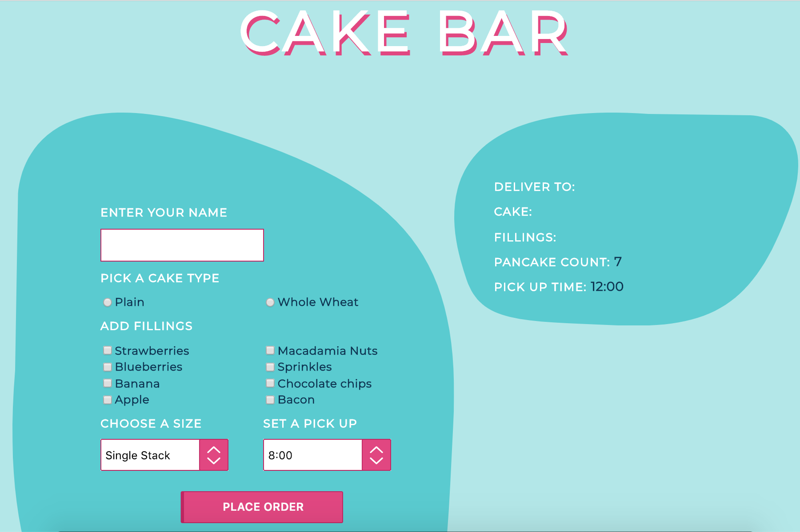
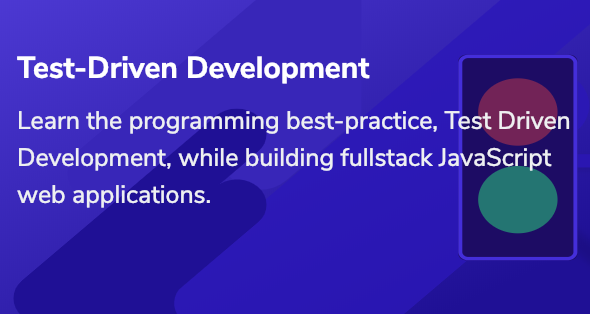

## cakebar-codecademy

#### Description
Simple form-based web app used to schedule delivery of cakes. Completed as a homework assignment for [Codecademy Test-Driven-Development (TDD) online course.](https://www.codecademy.com/pro/intensive/test-driven-development)

#### Technology

- Node.js (requires v8)
- Express
- Mocha & Chai
- Mongoose & MongoDB

#### Setting Up

- requires Node.js and MongoDB to be installed

1. `git clone git@github.com:kevcom/cakebar-codecademy.git`
2. `cd cakebar-codecademy`
3. `mongod --dbpath ./db`
4. `npm install`

#### Running

- **TESTS** (Because TDD is awesome): `npm test`
- **SERVER**: `npm start`